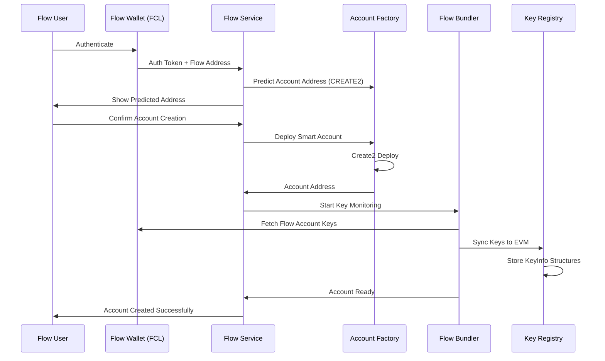
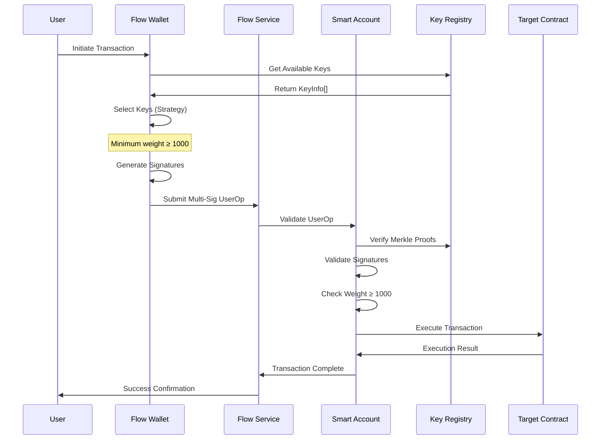
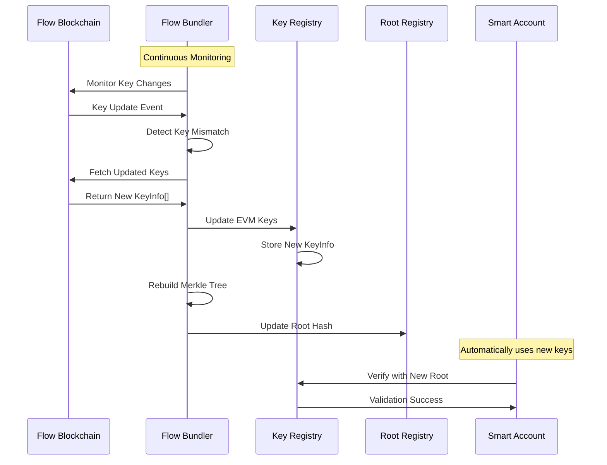
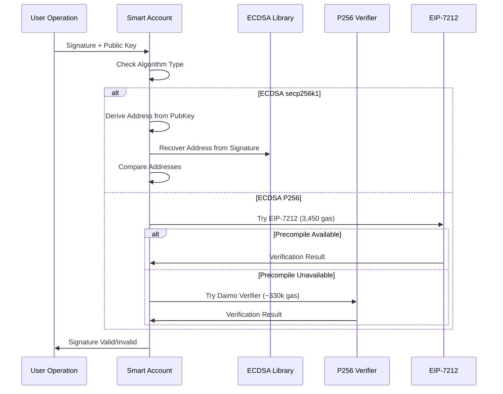

# Flow ZKP - Technical Specification

## Overview

Flow ZKP is a cross-chain account abstraction system that enables Flow blockchain users to control ERC-4337 smart accounts on EVM chains. The project bridges Flow's native account model with Ethereum's account abstraction standard, allowing seamless multi-chain operations.

## Table of Contents

- [Architecture Overview](#architecture-overview)
- [System Components](#system-components)
- [Signature Verification System](#signature-verification-system)
- [Sequence Diagrams](#sequence-diagrams)
- [Smart Contracts](#smart-contracts)
- [TypeScript Components](#typescript-components)
- [Integration Points](#integration-points)
- [Deployment Architecture](#deployment-architecture)
- [Security Considerations](#security-considerations)

## Architecture Overview

The system has evolved through two major versions:

- **V1 (Legacy)**: ZKP-based approach using zero-knowledge proofs (deprecated)
- **Current**: Multi-signature approach with CREATE2 deployment and EVM-side key management

### Key Benefits

- **60% gas reduction** compared to ZKP approach
- **Real-time key synchronization** between Flow and EVM
- **Multi-signature support** with weight-based thresholds
- **CREATE2 deployment** for predictable account addresses
- **Enhanced security** with proper signature verification

## System Components

### Core Architecture

```
┌─────────────────┐    ┌─────────────────┐    ┌─────────────────┐
│   Flow Chain    │◄──►│    Bundler      │◄──►│   EVM Chain     │
│                 │    │                 │    │                 │
│ • Flow Accounts │    │ • Key Monitor   │    │ • Smart Account │
│ • Native Keys   │    │ • Sync Service  │    │ • Key Registry  │
│ • Signatures    │    │ • Merkle Trees  │    │ • Root Registry │
└─────────────────┘    └─────────────────┘    └─────────────────┘
```

### Component Relationships

```
┌──────────────────────────────────────────────────────────────┐
│                     Flow ZKP System                         │
├──────────────────────────────────────────────────────────────┤
│                                                              │
│  ┌─────────────┐   ┌─────────────┐   ┌─────────────────────┐ │
│  │ Flow Wallet │──►│ Flow Service│──►│  Bundler Service    │ │
│  │ (FCL Auth)  │   │             │   │                     │ │
│  └─────────────┘   └─────────────┘   └─────────────────────┘ │
│         │                 │                     │             │
│         │                 ▼                     ▼             │
│         │        ┌─────────────────┐   ┌─────────────────────┐ │
│         │        │ Smart Account   │◄──│ EVM Contracts       │ │
│         │        │ Factory         │   │ (Registry System)   │ │
│         │        └─────────────────┘   └─────────────────────┘ │
│         │                                       │             │
│         └───────────────────────────────────────┘             │
│                      Transaction Flow                         │
└──────────────────────────────────────────────────────────────┘
```

## Signature Verification System

### Multi-Algorithm Support

The system supports both Flow's native signature algorithms with proper cryptographic verification:

#### ECDSA secp256k1 Verification

```solidity
function _verifySecp256k1SignatureAgainstKey(
    bytes32 hash,
    bytes memory signature,
    bytes memory publicKey
) internal pure returns (bool isValid) {
    // 1. Derive expected address from public key
    bytes32 publicKeyHash = keccak256(publicKey);
    address expectedSigner = address(uint160(uint256(publicKeyHash)));
    
    // 2. Recover signer address from signature
    address recoveredSigner = hash.recover(signature);
    
    // 3. Compare addresses
    return (recoveredSigner == expectedSigner);
}
```

#### ECDSA P256 Verification

```solidity
function _verifyP256SignatureAgainstKey(
    bytes32 hash,
    bytes memory signature,
    bytes memory publicKey
) internal view returns (bool isValid) {
    // Method 1: Try EIP-7212 precompile (3,450 gas)
    // Method 2: Try daimo-eth p256-verifier (~330k gas)
    // Method 3: Fallback with clear error message
}
```

### Verification Flow

```
┌─────────────────┐    ┌─────────────────┐    ┌─────────────────┐
│ Original Message│───►│ Signature + Key │───►│ Verification    │
│                 │    │                 │    │ Result          │
│ • Operation Hash│    │ • Flow Signature│    │ • Valid/Invalid │
│ • User Intent   │    │ • Public Key    │    │ • Address Match │
└─────────────────┘    └─────────────────┘    └─────────────────┘
```

## Sequence Diagrams

### 1. Account Creation Flow



### 2. Multi-Signature Transaction Execution



### 3. Key Synchronization Flow



### 4. Signature Verification Flow



## Smart Contracts

### FlowControlledSmartAccount.sol

**Purpose**: Multi-signature ERC-4337 smart account with Flow key validation

**Key Features**:
- Multi-signature validation with weight threshold (≥ 1000)
- Array-based UserOp for multiple keys/signatures
- KeyInfo-based Merkle proof verification
- UUPS upgradeable pattern
- Duplicate key prevention
- Proper signature verification for both secp256k1 and P256

**Core Functions**:
```solidity
function validateUserOp(FlowMultiSigUserOp memory userOp) external returns (uint256);
function executeUserOp(FlowMultiSigUserOp memory userOp, address target, bytes calldata data, uint256 value) external returns (bool);
function _validateSingleSignature(bytes32 opHash, bytes memory signature, FlowKeyRegister.KeyInfo memory keyInfo) internal pure returns (bool);
```

### FlowKeyRegister.sol

**Purpose**: EVM-side centralized registry for Flow account keys

**Key Features**:
- Stores complete Flow key metadata (KeyInfo structures)
- Weight-based multi-signature support
- Admin override capabilities
- Authorized bundler management

**Core Functions**:
```solidity
function setAccountKeys(address flowAddress, KeyInfo[] memory keys) external;
function getAccountKeys(address flowAddress) external view returns (KeyInfo[] memory);
function getTotalWeight(address flowAddress) external view returns (uint256);
```

### FlowRootRegistry.sol

**Purpose**: Stores and manages Merkle roots for Flow accounts

**Key Features**:
- Trusted bundler-managed root updates
- Root freshness validation (max age: 1 hour)
- Merkle proof verification utilities

**Core Functions**:
```solidity
function updateRoot(address flowAddress, bytes32 newRoot) external;
function verifyMerkleProof(bytes32 leaf, bytes32[] memory proof, bytes32 root) external pure returns (bool);
function isRootFresh(address flowAddress) external view returns (bool);
```

### FlowAccountFactory.sol

**Purpose**: CREATE2 factory for deterministic smart account deployment

**Key Features**:
- Deterministic address generation using Flow address
- Batch account creation support
- Flow address-only initialization

**Core Functions**:
```solidity
function createAccount(address flowAddress) external returns (address account);
function getAccount(address flowAddress) external view returns (address account);
function predictAccountAddress(address flowAddress) external view returns (address predicted);
```

## TypeScript Components

### FlowControlledService.ts

**Purpose**: Main orchestration service for Flow-controlled ERC-4337

**Key Responsibilities**:
- Service initialization and lifecycle management
- Wallet authentication integration
- Smart account deployment coordination
- Multi-signature operation execution

### FlowControlledBundler.ts

**Purpose**: Flow blockchain monitoring and EVM synchronization

**Key Responsibilities**:
- Real-time Flow account key monitoring
- Automatic key mismatch detection
- Merkle tree generation from KeyInfo structures
- EVM registry synchronization

### FlowControlledWallet.ts

**Purpose**: Flow wallet integration and key management

**Key Responsibilities**:
- Flow wallet authentication via FCL
- Native Flow key discovery and loading
- Multi-signature creation with selection strategies
- UserOperation generation

### MerkleTreeUtils.ts

**Purpose**: KeyInfo-based Merkle tree operations

**Key Functions**:
- Deterministic Merkle tree construction
- KeyInfo hash generation
- Proof generation and verification

## Integration Points

### Flow Blockchain Integration

- **FCL (Flow Client Library)**: Primary integration for Flow blockchain interaction
- **Cadence Queries**: Real-time key fetching from Flow accounts
- **Key Format Conversion**: Transform Flow native keys to EVM KeyInfo structures
- **Block Height Tracking**: Monitor Flow blockchain state

### EVM Integration

- **ERC-4337 Compliance**: Standard account abstraction interface
- **CREATE2 Deployment**: Deterministic account address generation
- **Multi-Signature Validation**: Weight-based threshold validation
- **Gas Optimization**: Efficient verification methods

## Deployment Architecture

### Network Configuration

```
┌─────────────────┐    ┌─────────────────┐    ┌─────────────────┐
│ Flow Testnet/   │    │ Cross-Chain     │    │ EVM Networks    │
│ Mainnet         │    │ Bridge          │    │                 │
│                 │    │                 │    │ • Ethereum      │
│ • Flow Accounts │◄──►│ • Bundler       │◄──►│ • Polygon       │
│ • Native Keys   │    │ • Sync Service  │    │ • BSC           │
│ • Signatures    │    │ • Monitoring    │    │ • Arbitrum      │
└─────────────────┘    └─────────────────┘    └─────────────────┘
```

### Deployment Process

1. **Deploy Core Contracts**: FlowKeyRegister, FlowRootRegistry
2. **Deploy Account Implementation**: FlowControlledSmartAccount
3. **Deploy Factory**: FlowAccountFactory with implementation reference
4. **Configure Permissions**: Set bundler addresses and admin roles
5. **Start Monitoring**: Initialize bundler services for key synchronization

## Security Considerations

### Signature Verification Security

- **Proper Cryptographic Verification**: Direct verification against public keys, not address comparison
- **Algorithm Support**: Native support for Flow's ECDSA_P256 and ECDSA_secp256k1
- **Replay Protection**: Nonce-based protection against transaction replay
- **Weight Validation**: Enforce minimum weight threshold (1000) for valid operations

### Access Control

- **Admin Controls**: Emergency functions with time-locked admin access
- **Bundler Authorization**: Restricted key update permissions
- **Upgrade Safety**: UUPS upgradeable pattern with proper access controls

### Cross-Chain Security

- **Root Freshness**: Maximum 1-hour age for Merkle roots
- **Key Synchronization**: Automatic detection and resolution of key mismatches
- **Monitoring**: Continuous monitoring of Flow blockchain state

## Performance Metrics

### Gas Optimization

- **Current vs Legacy**: 60% gas reduction compared to ZKP approach
- **Signature Verification**: 
  - secp256k1: ~21,000 gas (ecrecover)
  - P256 with EIP-7212: ~3,450 gas
  - P256 with daimo-eth: ~330,000 gas

### Scalability

- **Batch Operations**: Support for multiple signatures and operations
- **CREATE2 Deployment**: Predictable addresses without deployment
- **Efficient Merkle Proofs**: Logarithmic verification complexity

## Future Enhancements

### Planned Improvements

- **Additional Signature Algorithms**: Support for Ed25519 and other curves
- **Enhanced Privacy**: Optional commitment schemes for sensitive operations
- **Cross-Chain Expansion**: Support for additional EVM-compatible networks
- **Gas Optimization**: Further reductions through assembly optimizations

### Research Areas

- **Hybrid ZKP Approach**: Selective use of ZKP for high-privacy operations
- **Layer 2 Integration**: Native support for rollup networks
- **Interoperability Standards**: Adoption of emerging cross-chain standards

---

## Appendix

### Key Data Structures

#### KeyInfo Structure
```solidity
struct KeyInfo {
    bytes publicKey;        // 64 bytes uncompressed
    uint8 signatureAlgorithm; // 1=P256, 2=secp256k1
    uint8 hashAlgorithm;    // 1=SHA2_256, 3=SHA3_256
    uint256 weight;         // Weight for multi-sig (max 1000)
}
```

#### FlowMultiSigUserOp Structure
```solidity
struct FlowMultiSigUserOp {
    bytes32 opHash;         // Operation hash
    KeyInfo[] keys;         // Array of signing keys
    bytes[] signatures;     // Corresponding signatures
    bytes32[][] merkleProofs; // Merkle inclusion proofs
}
```

### Error Codes

- `SmartAccount: insufficient signature weight` - Total weight < 1000
- `SmartAccount: invalid signature` - Signature verification failed
- `SmartAccount: invalid Merkle proof` - Key not in current root
- `SmartAccount: duplicate key` - Same key used multiple times
- `SmartAccount: unsupported signature algorithm` - Unknown algorithm

### Configuration Parameters

- **Weight Threshold**: 1000 (represents 100%)
- **Root Max Age**: 3600 seconds (1 hour)
- **Max Keys Per Operation**: 20
- **Batch Size Limit**: 20 accounts per batch